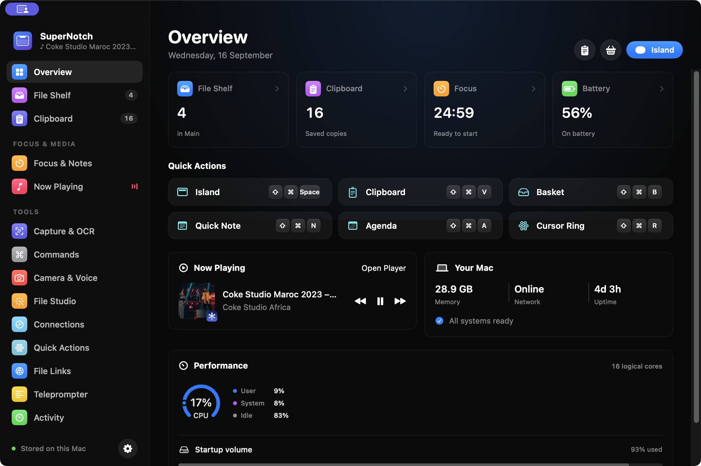

# SuperNotch

<p align="center">
  <strong>A native macOS productivity island for your files, music, clipboard, focus, and everyday tools.</strong>
</p>

<p align="center">
  <a href="https://github.com/VexilLLC/SuperNotch/actions/workflows/build.yml"></a>
  
  
  <a href="LICENSE"></a>
</p>



> [!NOTE]
> SuperNotch is an independent open-source project in active development. The app is usable, but some integrations and advanced workflows are still evolving. The screenshot above is the real app running from this repository.

SuperNotch turns the area around a MacBook notch—or the top center of any display—into a compact island. Drop in files, control media, start a focus session, open quick notes, check your agenda, or expand into a larger workspace when you need more room.

It is written in Swift and SwiftUI, uses native macOS frameworks, and has no third-party Swift package dependencies.

## Highlights

### Island and workspace

- A notch-aware island that expands on click and accepts file drops.
- A Raycast-style command palette on Option-Space for apps, SuperNotch actions, clipboard history, custom commands, and local extensions.
- Home, Tray, and Widgets pages with keyboard navigation.
- Configurable display placement, accent color, outline, widget order, and Home layout.
- A larger native workspace for browsing every tool.
- Global shortcuts, menu-bar access, app links, and an optional Alfred workflow.

### Files and clipboard

- Persistent file shelves and up to twelve named baskets.
- Native thumbnails, Quick Look, Finder reveal, drag and drop, sharing, pinning, and retention controls.
- A floating clipboard strip plus a searchable full clipboard library.
- Text, links, rich text, images, file references, tags, source-app badges, and color previews.
- Concealed, transient, password-related, and known password-manager clipboard types are skipped when marked by the source application.

### Media and focus

- System-wide Now Playing metadata, artwork, progress, and controls.
- Apple Music and Spotify scripting fallbacks.
- Optional Dockless Spotify mode with one-click setup, full-window reopening, and a complete restore backup.
- Output-device selection and supported system volume or mute controls.
- Persistent focus timer, break presets, completion activity, notes, Calendar agenda, Reminders, and Keep Awake.

### Tools

- Region capture, OCR, image conversion, background removal, batch resizing, video export, and PDF raster compression.
- App and file launcher, asynchronous shell command runner, and window positioning.
- Camera mirror, voice recording, Apple Speech transcription, and emoji picker.
- Markdown vault editor with external-change detection.
- Weather through Open-Meteo, local coding-agent events, teleprompter, and temporary local file links.
- A live performance dashboard with CPU history, memory pressure, load averages, uptime, disk throughput, best-effort GPU activity, storage health, connectivity, mounted volumes, and system events.
- A Battery tab with health/cycles, hardware charge, live power flow, resource-heavy apps, heat alerts, and an optional model-aware charge controller for supported Macs. Installing its privileged helper requires an explicit administrator approval.
- Optional Codex, Claude, and OpenCode usage widgets with quota windows and local history summaries.

The detailed implementation and parity status lives in [the feature matrix](docs/FEATURE_PARITY.md).

## Requirements

- macOS 14 Sonoma or later
- Xcode with the Swift 6 toolchain
- Apple Silicon for prebuilt artifacts produced on an Apple Silicon Mac

The source can be compiled on Intel Macs, but the current packaging script builds only for the architecture of the machine running it.

## Build and run

```sh
git clone https://github.com/VexilLLC/SuperNotch.git
cd SuperNotch
./scripts/build-app.sh release
open build/SuperNotch.app
```

For development:

```sh
swift test
./scripts/build-app.sh debug
open build/SuperNotch.app
```

You can also open `Package.swift` directly in Xcode.

Use the packaged `.app` when testing protected macOS APIs. Running only the raw Swift executable does not provide the bundle identity or usage descriptions needed for Camera, Microphone, Speech, Calendar, Reminders, Screen Capture, Automation, and Finder Services.

### Dockless Spotify

Open **Settings → Music → Spotify Dock Icon** and choose **Set Up**. SuperNotch installs its bundled local helper into the existing Spotify application and keeps Spotify running as an accessory app without a Dock or Command-Tab entry. The arrow in the island toggles the normal Spotify window open and closed while playback continues, and the island provides Spotify play/pause, previous/next, and seeking controls.

Setup modifies the local Spotify application in place and applies an ad-hoc signature. Before doing so, SuperNotch verifies and saves a complete versioned copy of the original app under `~/Library/Application Support/SuperNotch/SpotifyDock/Backups/`. Choose **Restore** to put that untouched signed copy back. A Spotify update replaces the modified app, so run Set Up again after updating if the Dock icon returns.

This integration is implemented and packaged by SuperNotch itself; it does not install or invoke GhostTile or another background utility.

## Shortcuts

| Action | Shortcut |
| --- | --- |
| Command palette | <kbd>⌥</kbd> <kbd>Space</kbd> |
| Toggle island | <kbd>⇧</kbd> <kbd>⌘</kbd> <kbd>Space</kbd> |
| Clipboard strip | <kbd>⇧</kbd> <kbd>⌘</kbd> <kbd>V</kbd> |
| Floating basket | <kbd>⇧</kbd> <kbd>⌘</kbd> <kbd>B</kbd> |
| Quick notes | <kbd>⇧</kbd> <kbd>⌘</kbd> <kbd>N</kbd> |
| Agenda | <kbd>⇧</kbd> <kbd>⌘</kbd> <kbd>A</kbd> |
| Cursor ring | <kbd>⇧</kbd> <kbd>⌘</kbd> <kbd>R</kbd> |
| Close the active floating surface | <kbd>Esc</kbd> |
| Switch Island Home, Tray, Widgets | <kbd>⌘</kbd> <kbd>1</kbd> / <kbd>2</kbd> / <kbd>3</kbd> |

The workspace opens on first launch. Later launches stay in the notch and menu bar until opened.

## Privacy and data

SuperNotch is local-first, but not completely offline.

| Data | Behavior |
| --- | --- |
| Shelf and clipboard | Stored under `~/Library/Application Support/SuperNotch/` |
| Notes, timer, layout | Stored in this app's `UserDefaults` |
| Recordings | Stored locally under SuperNotch Application Support |
| Weather | Sends an explicitly entered city and selected coordinates to Open-Meteo |
| Speech | Uses on-device recognition by default; online recognition requires its separate toggle |
| Local file links | Loopback-only by default; optional LAN sharing uses temporary HTTP links that expire after one hour |
| AI usage | Detects supported provider logins locally and sends quota requests only to the corresponding provider |

The current development build enables newly detected AI-usage providers by default. A refresh may use and rotate the provider's existing CLI credential. Credentials and conversation content are not stored in SuperNotch's usage snapshot cache.

Clipboard privacy markers are respected when applications provide them, but no clipboard manager can reliably identify every secret copied by an application that supplies no privacy metadata. Pause clipboard capture whenever you do not want copies recorded.

See [Architecture](docs/ARCHITECTURE.md) for storage paths, data flow, local-sharing boundaries, and permission details.

## Performance

The current performance work moved animated meters to Core Animation, stopped per-frame hosting-view measurement, isolated the media progress clock, batches clipboard persistence, caches bounded thumbnails, and releases closed SwiftUI view trees.

On the recorded Apple Silicon test machine, the release build measured approximately:

| Scenario | CPU | Physical footprint |
| --- | ---: | ---: |
| Collapsed and idle | 0.23% | 20 MB |
| Island open | 0.75% | 25 MB |
| Workspace overview | 0.96% | 44 MB |
| Clipboard workspace | 0.26% | 75 MB settled |

These are measurements from one Mac, not universal guarantees. Read the methodology and current open items in [Performance](docs/PERFORMANCE.md).

## Validation status

The repository currently contains 122 XCTest regression tests. They cover core persistence, clipboard behavior, tags and colors, AI-usage mapping, file shelves and baskets, thumbnails, image conversion, commands, app links, local sharing, activities, artwork, media timing, battery and charge-limit policy, system performance, visual sizing, and safe Mach-O helper insertion.

```sh
swift test
```

Builds and tests are also defined in [GitHub Actions](.github/workflows/build.yml). Hardware-, account-, network-, display-, and permission-dependent behavior is not exhaustively automated. The complete checked and unchecked surface is recorded in [Validation](docs/VALIDATION.md).

## Distribution status

The local build script applies an ad-hoc signature for development. Public binary distribution still requires a Developer ID identity, hardened-runtime validation, notarization, and testing on a clean Mac.

System-wide Now Playing currently uses Apple's private `MediaRemote` framework through a bundled helper. This is not suitable for Mac App Store submission, can change without notice, and has Apple Music and Spotify scripting fallbacks when unavailable.

Dockless Spotify is also intended for local development builds: it changes and ad-hoc signs the installed Spotify bundle, which invalidates Spotify's original Developer ID signature until Restore or a Spotify update replaces it.

The optional charge controller installs a root launch daemon only after explicit administrator approval and uses undocumented AppleSMC interfaces. Hardware support varies by Mac model; unsupported machines retain the alert-only behavior. Treat this integration as experimental until it has broader hardware coverage.

## Project map

```text
Sources/SuperNotch/       App, island, workspace, models, and tools
Sources/ChargeLimitCore/  Charge-control policy and AppleSMC adapter
Sources/SuperNotchChargeHelper/  Optional privileged charge helper
Tests/SuperNotchTests/    XCTest regression suite
Helpers/NowPlaying/       Optional system-wide media helper
Helpers/SpotifyDock/      Optional Dockless Spotify helper
Resources/                App icon, provider artwork, and Info.plist
integrations/alfred/      Alfred workflow source and packager
scripts/                  App bundle and icon build scripts
docs/                     Architecture, validation, performance, and parity notes
```

Create local command-palette extensions from **Add Extension** inside SuperNotch, or import bounded versioned JSON manifests for multi-command packages. See [Command palette extensions](docs/EXTENSIONS.md) for the supported built-in, URL, and explicit shell-command actions.

For module ownership and entry points, see [Architecture](docs/ARCHITECTURE.md).

## Contributing

Contributions and focused bug reports are welcome. See [CONTRIBUTING.md](CONTRIBUTING.md) for the development workflow and safety requirements. Keep changes native, asynchronous where work may block, and non-destructive to user files.

When changing persistence, permissions, lifecycle behavior, file processing, or networking:

1. Preserve existing user data and original files.
2. Keep external requests explicit and documented.
3. Add a regression test when the behavior can be exercised without private hardware or accounts.
4. Run `swift test` and `./scripts/build-app.sh release` before opening a pull request.

Please report vulnerabilities privately according to [SECURITY.md](SECURITY.md).

## Attribution and independence

SuperNotch is an original implementation and does not reuse proprietary binaries, artwork, licensing systems, or cloud services.

Provider-integration ideas and provider SVG assets adapted from [OpenUsage](https://github.com/robinebers/openusage) retain their MIT attribution in [NOTICE](NOTICE). Weather data is provided by [Open-Meteo](https://open-meteo.com/) under CC BY 4.0.

## License

SuperNotch is available under the [MIT License](LICENSE).
